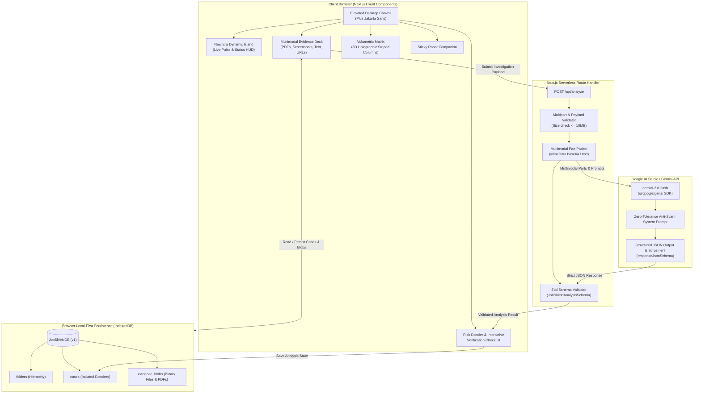

# JobShield 🛡️
> **"Verify before you trust."**  
> Next-generation recruitment evidence intake and AI-powered fraud investigation platform powered by **Google Gemini 3.8 Flash** multimodal intelligence.

[](https://nextjs.org/)
[](https://ai.google.dev/)
[](https://www.typescriptlang.org/)
[](https://tailwindcss.com/)
[](LICENSE)
[](https://vercel.com/new/clone?repository-url=https%3A%2F%2Fgithub.com%2FPranjalwork1%2FJobShield&root-directory=jobshield&env=GEMINI_API_KEY,GEMINI_MODEL&envDescription=Your%20Google%20Gemini%20API%20Key%20from%20Google%20AI%20Studio&envLink=https%3A%2F%2Faistudio.google.com%2Fapikey&project-name=jobshield)

---

## 📸 Interface Preview


JobShield features an elevated glassmorphic aesthetic inspired by modern fintech command centers:
- **New Era Dynamic Island**: Pinned glassmorphic HUD capsule floating at top-center with live pulse indicators, real-time investigation telemetry, and expandable controls.
- **Volumetric 3D Metric Columns**: Holographic striped indicators providing instantaneous visual feedback across Documents, Pitch Credibility, Domain Legitimacy, and Overall Trust.
- **Zentra Segmented Workspace**: Elevated desktop canvas with rounded pill contours (`rounded-[44px]`), organized across *Overview*, *Evidence Deck*, *Risk Dossier*, and *Verification*.
- **Docked AI Prompt Capsule**: Natural language interaction bar with preset verification slash commands (`/offer-authenticity`, `/recruiter-identity`, `/wire-fraud-check`, `/salary-benchmark`).
- **Interactive Robot Companion**: Pinned assistant offering real-time guidance and instant intake focusing.

---

## 🎯 The Mission & The Problem

Employment scams have surged by over 400% in recent years. Predatory actors impersonate Fortune 500 recruiters, orchestrate fake multi-stage interviews, and distribute deceptive offer letters demanding:
* Upfront "mandatory onboarding equipment deposits" or "training certification fees".
* Immediate submission of government IDs (Aadhaar, SSN, PAN) and banking coordinates before formal hire.
* Phishing redirects through subtly mistyped corporate domains (typosquatting).

**JobShield solves this.** Rather than reducing complex fraud signals to an arbitrary, ungrounded "scam score," JobShield functions as an **evidence-backed investigation workstation**. It ingests actual offer letter PDFs, recruiter emails, WhatsApp/Telegram screenshots, and job URLs, passing them through Google Gemini's multimodal vision and reasoning models to isolate empirical, verifiable facts.

---

## 🏛️ System Architecture



---

## 🔬 Core Capabilities

### 1. Strict Folder & Case Isolation
* **Folder Hierarchy**: Group cases by categories (e.g., *Remote Jobs*, *India Tech*, *Shortlisted*, *Needs Verification*).
* **Zero Cross-Contamination**: Each job case maintains its own isolated evidence files, recruiter text, job URL, Gemini analysis dossier, and checklist. Switching cases immediately unloads and loads the exact case state without memory leaks.

### 2. Native IndexedDB Binary Persistence
* Uploaded PDFs and high-resolution screenshots are binary Blobs that quickly overwhelm `localStorage` quotas (5MB).
* JobShield uses native **IndexedDB** (`JobShieldDB` v1) with three decoupled stores (`folders`, `cases`, and `evidence_blobs`), allowing candidate dossiers to persist securely on-device with zero server storage overhead.

### 3. Google Gemini 3.8 Flash Multimodal Reasoning
* Server-side route handler parses image buffers and PDF documents directly via Gemini's `inlineData` capability.
* Powered by strict JSON Schema generation (`responseJsonSchema`), guaranteeing valid, structured outputs containing:
  * **Observable Facts**: Raw facts stated in the evidence (company claims, salary, role).
  * **Red Flags**: Categorized into `upfront_payment_demand`, `suspicious_recruiter_domain`, `sensitive_identity_request`, `unrealistic_compensation`, and `urgent_onboarding_pressure`.
  * **Contradictions**: Discrepancies between official branding and communication channels.
  * **Interactive Verification Targets**: Actionable step-by-step tasks candidates can execute and check off in real-time.

### 4. Volumetric Metric Engine
* Dynamic 3D diagonal-striped indicators that dynamically animate and calculate confidence across 4 distinct dimensions:
  * 📄 **Document Density**: Volume and completeness of formal contractual materials.
  * 💬 **Pitch Integrity**: Cross-checks recruiter communication tone, urgency, and channels.
  * 🌐 **Domain Credibility**: Domain registration patterns and official email parity.
  * 🛡️ **Composite Trust Meter**: Weighted trust index derived from Gemini findings.

---

## 📂 Project Structure

```text
JobShield/
├── jobshield/                         # Next.js Application Root
│   ├── app/
│   │   ├── api/
│   │   │   └── analyze/
│   │   │       └── route.ts           # Serverless Gemini Multimodal API endpoint
│   │   ├── favicon.ico
│   │   ├── globals.css                # Plus Jakarta Sans tokens & glassmorphic utilities
│   │   ├── layout.tsx                 # Root layout with font configuration & SEO metadata
│   │   └── page.tsx                   # Main investigation workstation & state coordinator
│   ├── components/
│   │   ├── AnalysisResult.tsx         # Full risk dossier, flags, and checklist renderer
│   │   ├── BottomConsole.tsx          # Evidence text, URL, and instant action console
│   │   ├── CaseHeader.tsx             # Case metadata, status pill, and action bar
│   │   ├── CaseWorkspace.tsx          # Full-width case canvas
│   │   ├── FloatingDock.tsx           # Floating quick-action dock
│   │   ├── IntakeCardDeck.tsx         # Drag-and-drop file upload & evidence intake deck
│   │   ├── LoadingAnalysis.tsx        # Animated telemetry radar during Gemini analysis
│   │   ├── NewEraDynamicIsland.tsx    # Glassmorphic top-floating HUD capsule
│   │   ├── RobotMascot.tsx            # Sticky interactive AI assistant companion
│   │   ├── ZentraHeroCard.tsx         # 3D striped metric columns & AI prompt bar
│   │   └── ZentraTopNav.tsx           # Segmented pill navigation & folder switcher
│   ├── lib/
│   │   ├── caseStore.ts               # IndexedDB local-first persistence engine
│   │   ├── demoData.ts                # Built-in realistic scam case for demonstration
│   │   ├── gemini.ts                  # Google Gen AI SDK client configuration
│   │   └── schemas.ts                 # Zod validation schemas for Gemini responses
│   ├── types/
│   │   └── jobshield.ts               # TypeScript data models (Case, Evidence, Folder)
│   ├── .env.example                   # Environment configuration template
│   ├── next.config.ts                 # Next.js 16 configuration
│   ├── package.json                   # Dependencies & npm scripts
│   └── tsconfig.json                  # TypeScript compiler settings
├── ui final.webp                      # Final UI design reference
├── ui.webp                            # Initial design mockup
├── package.json                       # Workspace root scripts
└── README.md                          # Project documentation
```

---

## 🚀 Quick Start & Usage

### Prerequisites
- [Node.js](https://nodejs.org/) (v20.x or higher)
- [npm](https://www.npmjs.com/) (v10.x or higher)
- A **Google Gemini API Key** from [Google AI Studio](https://aistudio.google.com/apikey).

### 1. Clone the Repository
```bash
git clone https://github.com/Pranjalwork1/JobShield.git
cd JobShield
```

### 2. Install Dependencies
```bash
cd jobshield
npm install
```

### 3. Configure Environment Variables
Create your local environment file from the provided template:
```bash
cp .env.example .env.local
```

Edit `.env.local` and add your Gemini API Key:
```env
GEMINI_API_KEY=your_actual_gemini_api_key_here
GEMINI_MODEL=gemini-3.8-flash
```

### 4. Run Development Server
```bash
npm run dev
```

Open [http://localhost:3000](http://localhost:3000) in your browser.

### 5. Production Build & Verification
```bash
# Typecheck
npx tsc --noEmit

# Lint
npm run lint

# Production build
npm run build
```

---

## 🌐 One-Click Cloud Deployment (Vercel)

JobShield runs seamlessly on **[Vercel](https://vercel.com)** with native serverless support for Next.js 16 and Google Gemini 3.8 Flash multimodal processing.

### Option 1: One-Click Deploy Button
Click the badge below to clone and deploy with automatic configuration:

[](https://vercel.com/new/clone?repository-url=https%3A%2F%2Fgithub.com%2FPranjalwork1%2FJobShield&root-directory=jobshield&env=GEMINI_API_KEY,GEMINI_MODEL&envDescription=Your%20Google%20Gemini%20API%20Key%20from%20Google%20AI%20Studio&envLink=https%3A%2F%2Faistudio.google.com%2Fapikey&project-name=jobshield)

### Option 2: Deploy from Vercel Dashboard
1. Go to [vercel.com/new](https://vercel.com/new).
2. Connect your GitHub account and import the repository: **`Pranjalwork1/JobShield`**.
3. In **Project Configuration**:
   * **Root Directory**: Click *Edit* and select **`jobshield`**.
   * **Framework Preset**: Next.js (automatically detected).
4. In **Environment Variables**, add:
   * `GEMINI_API_KEY`: *(Your Gemini API key from Google AI Studio)*
   * `GEMINI_MODEL`: `gemini-3.8-flash`
5. Click **Deploy**. Your live site will be ready in under 60 seconds with SSL and continuous deployment on every `git push`.

---

## 🔍 Investigation Workflow

1. **Create or Select a Case**: Click `+ New Job Check` or select an existing case from your folders.
2. **Intake Evidence**:
   * Drag & drop PDF offer letters, contracts, or appointment letters.
   * Upload screenshots of WhatsApp, Telegram, or email communications.
   * Paste the recruiter's message text or interview invitation.
   * Enter the job posting or corporate URL.
   * *(Optional)* Click **"Load Demo Case"** to immediately test with a realistic high-risk sample scam.
3. **Trigger Gemini Multimodal Analysis**: Click **"Analyze Case"** in the console, the New Era Dynamic Island, or the AI Prompt capsule.
4. **Review the Risk Dossier**:
   * Inspect the **Risk Assessment** (Safe, Caution, Critical Risk).
   * Review verified **Observable Facts** extracted directly from evidence.
   * Review highlighted **Red Flags** with explicit citations linking back to uploaded files.
   * Execute the **Interactive Verification Targets** to verify recruiter identity and company domain records before sending sensitive information.

---

## 🔒 Privacy & Security

* **Local-First Privacy**: Candidate files, screenshots, and personal notes are stored locally in your browser's IndexedDB. They are never sent to third-party databases.
* **Transient Analysis**: Files are submitted directly to the serverless route handler for the sole purpose of generating the Gemini multimodal reasoning output and are not permanently retained on external servers.
* **No Secret Exposure**: `.env.local` and sensitive credentials are encrypted and git-ignored.

---

## 📄 License

This project is licensed under the [MIT License](LICENSE).
