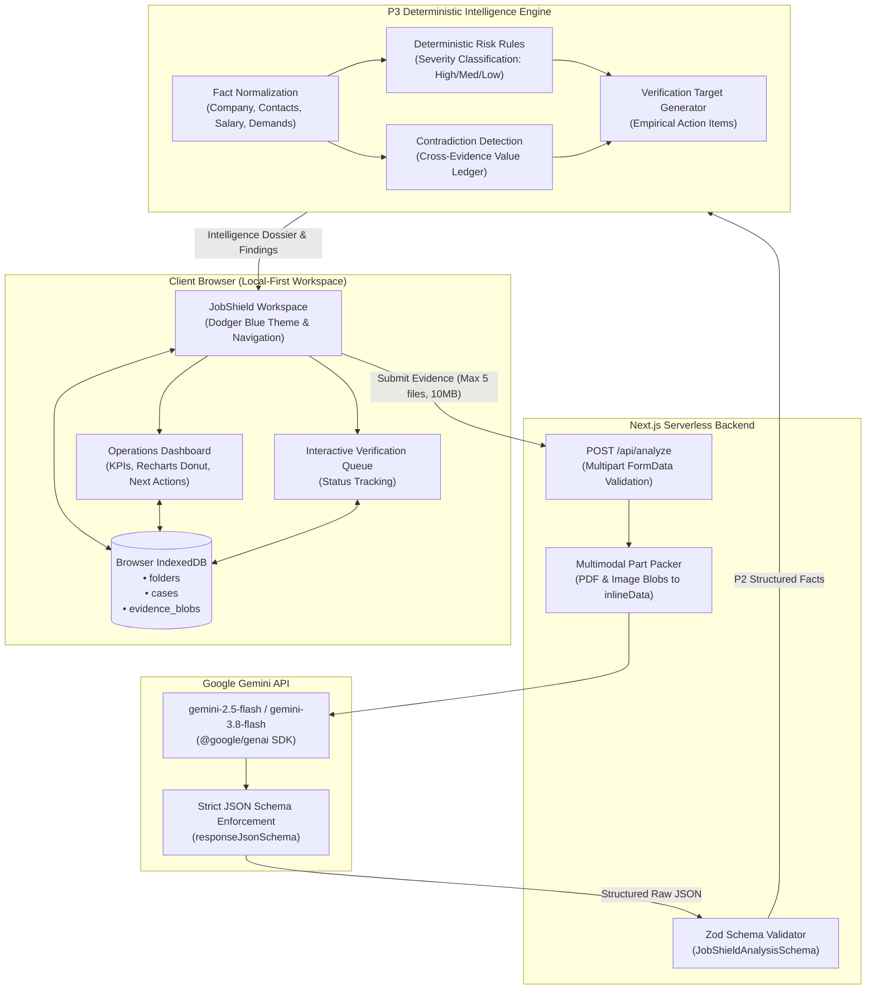

# 🛡️ JobShield

### Verify before you trust.

> **JobShield** is an AI-powered recruitment evidence analysis platform that helps job seekers organize job investigations, analyze offer letters and recruiter communications, surface evidence-backed risk indicators, detect inconsistencies, and create a structured verification queue before sharing money or sensitive information.

[](https://nextjs.org/)
[](https://www.typescriptlang.org/)
[](https://ai.google.dev/)
[](./lib/intelligence)
[](./lib/caseStore.ts)
[](https://recharts.org/)
[](https://tailwindcss.com/)
[](LICENSE)
[](https://vercel.com/new/clone?repository-url=https%3A%2F%2Fgithub.com%2FPranjalwork1%2FJobShield&root-directory=jobshield&env=GEMINI_API_KEY,GEMINI_MODEL&envDescription=Your%20Google%20Gemini%20API%20Key%20from%20Google%20AI%20Studio&envLink=https%3A%2F%2Faistudio.google.com%2Fapikey&project-name=jobshield)

---

## Product Preview


JobShield pairs a modern **Dodger Blue (`#1E90FF`)** visual identity with an evidence-first investigation console:
- **Operations Dashboard**: Real-time KPI summaries, interactive Recharts Risk Mix donut breakdown, verification progress health bar, and prioritized next actions.
- **Evidence Intake Deck**: Drag-and-drop workspace supporting multi-page PDF offer letters, chat screenshots, raw text, and job posting URLs.
- **Risk Dossier View**: Severity-tiered findings (High / Medium / Low) with direct citations, observed verbatim evidence quotes, and "Why This Matters" explanations.
- **Structured Verification Queue**: Interactive, checklist-driven action items (e.g., verifying corporate registration numbers, confirming recruiter identity, cross-checking official career portals).
- **In-Header Dynamic Status Pill**: Real-time investigation indicator embedded directly into navigation with case-level risk summaries and instant demo case hydration.

---

## The Problem

Job scams and deceptive recruitment practices have escalated dramatically in scale and sophistication. Modern job seekers receive suspicious materials scattered across multiple channels:

- **Unsolicited Recruiter Messages**: High-pressure pitches over WhatsApp, Telegram, SMS, or LinkedIn InMail.
- **Counterfeit Offer Letters**: Deceptively formatted PDF appointment letters featuring stolen corporate logos, fabricated signatures, and urgent onboarding instructions.
- **Financial Requests**: Demands for upfront "registration fees," "equipment deposits," "security clearance charges," or "training kits."
- **Sensitive Identity Harvesting**: Requests for government IDs (Aadhaar, PAN, SSN) and banking credentials before any interview or contract signature.
- **Fragmented Context**: Inconsistencies (e.g., salary promises of ₹12 LPA in chat vs. ₹8.5 LPA in the letter, or official company domains vs. `@gmail.com` recruiter contacts) that are easily overlooked when evidence is evaluated in isolation.

Job seekers need to answer one critical question:
> **"Does this recruitment interaction deserve further verification before I trust it?"**

JobShield exists to organize, isolate, cross-reference, and evaluate that evidence objectively.

---

## The Solution

JobShield abandons naive "black-box scam scores" in favor of a disciplined, transparent, multi-stage investigation pipeline:

```text
Supplied Evidence (PDFs, Images, Messages, URLs)
                     ↓
        Gemini Multimodal Extraction
                     ↓
         Structured Facts (Zod Validated)
                     ↓
      JobShield P3 Deterministic Intelligence
                     ↓
 Evidence-Backed Findings & Contradiction Detection
                     ↓
           Actionable Verification Queue
                     ↓
             Operations Dashboard
```

Rather than asking an LLM to guess whether a job is "legitimate" or "a scam", JobShield:
1. **Extracts verifiable facts** from documents, screenshots, and messages using Google Gemini vision and text reasoning.
2. **Normalizes facts** into strict structured entities (company names, recruiter handles, compensation packages, payment requests).
3. **Applies deterministic rules** to surface evidence-backed findings and identify cross-document contradictions.
4. **Links every finding directly back** to the original piece of evidence where it was observed.
5. **Generates empirical verification targets** empowering candidates to confirm facts independently before releasing money or identity documents.

---

## What Makes JobShield Different?

| Conventional "Scam Checkers" | JobShield Evidence Platform |
| :--- | :--- |
| **Opaque Scoring**: Outputs an arbitrary "87% scam probability" without reproducible explanation. | **Separation of Concerns**: AI extracts *what is stated*; deterministic rules determine *what findings apply*. |
| **Single-Input Limitation**: Only evaluates a URL or a block of text. | **Multi-Evidence Synthesis**: Cross-examines PDF offer letters against WhatsApp chat screenshots and job URLs simultaneously. |
| **No Contradiction Checking**: Fails to spot conflicting salaries or mismatched company identities across files. | **Deterministic Contradiction Engine**: Identifies semantic inconsistencies between documents with opposing value comparisons. |
| **Passive Warning**: Tells users to "be careful" with no actionable next steps. | **Structured Verification Queue**: Generates concrete verification tasks with status tracking (`not_started`, `in_progress`, `completed`). |
| **Cloud Centralized Storage**: Uploads personal candidate documents to remote third-party databases. | **Local-First Privacy**: Cases, binary blobs, and timelines persist strictly in the candidate's browser via IndexedDB. |

---

## Product Phases

### P1 — Evidence Intake & Case Management
- **Folder Hierarchy**: Group cases by custom workspaces (e.g., *Remote Jobs*, *India Tech*, *Shortlisted*).
- **Strict Case Isolation**: Each recruitment check retains its own independent evidence files, notes, Gemini extraction, P3 intelligence findings, and verification targets.
- **Multimodal Intake**: Ingest up to 5 concurrent evidence items (PDF offer letters up to 10 MB, PNG/JPEG/WEBP screenshots, recruiter message text, and job URLs).
- **Browser Local-First Persistence**: Native browser IndexedDB storage (`JobShieldDB` v1) with decoupled object stores for folders, cases, and binary blobs—ensuring zero data leaks and zero third-party cloud exposure.

### P2 — Gemini Multimodal Analysis
- **Multimodal Document Processing**: Uses Google Gemini multimodal capabilities via `@google/genai` to analyze PDFs, high-resolution screenshots, and message transcripts.
- **Strict JSON Schema Enforcement**: Enforces a strict response schema validated end-to-end via Zod (`JobShieldAnalysisSchema`).
- **Structured Fact Extraction**:
  - Employer identity (stated company name, claimed registration, corporate domain).
  - Position metadata (job title, work location, compensation terms).
  - Recruiter contact details (name, email address, phone number).
  - Explicit requests (upfront fees, equipment deposits, sensitive identity/financial documents).
  - Stated claims and verifiable evidence excerpts.

### P3 — JobShield Intelligence Engine
- **Deterministic Normalization**: Normalizes company identities (legal suffix stripping), email domains (flagging free/public email providers), phone numbers, and compensation figures into structured entities.
- **Rule-Based Finding Derivation**: Deterministic heuristics evaluate facts to generate traceable findings classified by severity:
  - `HIGH`: Upfront payment demands, financial credential requests.
  - `MEDIUM`: Public email domains for corporate recruiters, unverified identity document collection.
  - `LOW`: Informal communication channels, vague job specifications.
- **Cross-Evidence Contradiction Detection**: Compares facts across different pieces of evidence to highlight discrepancies in salary, role designation, company identity, or contact channels.
- **Audit Traceability**: Every finding references the specific evidence item and location where the signal was detected.
- **Verification Task Generator**: Automatically derives targeted action steps mapped to the surfaced risks.
- **Case Audit Timeline**: Chronologically records case creation, evidence additions, intelligence runs, and verification task completions.

> *Note: P3 is a local deterministic inference and contradiction engine. It evaluates supplied evidence and does not perform active outbound web crawling or external database lookups.*

---

## Case & Folder Management

JobShield enforces total data isolation between recruitment investigations. Files or notes uploaded to one case cannot bleed into another:

```text
📁 All Jobs (Global Repository)
│
├── 📁 Remote Opportunities
│   ├── 📄 Senior Full-Stack Engineer — Acme Corp (Analyzed • 3 Findings)
│   └── 📄 Product Designer — CloudScale Inc (Draft • 1 File Attached)
│
└── 📁 Campus & Direct Applications
    ├── 📄 Graduate Trainee — Global Tech Solutions (Needs Verification • 1 High Risk)
    └── 📄 Operations Associate — Logistics Hub (Analyzed • 0 Findings)
```

Each case maintains its own:
- Uploaded binary documents (PDFs, screenshots)
- Structured normalized facts
- Severity-tagged findings
- Contradiction ledger
- Interactive verification queue
- Chronological investigation timeline

---

## Operations Dashboard

The JobShield Operations Dashboard synthesizes investigation telemetry across all cases or within a selected folder:

```text
┌─────────────────────────────────────────────────────────────────────────────────────────┐
│  ACTIVE CHECKS        ANALYZED CASES        RISK FINDINGS        OPEN TARGETS           │
│       12                    9                    15                   6                 │
│  All folders          82% coverage          3 High Priority      4 Pending Action       │
└─────────────────────────────────────────────────────────────────────────────────────────┘
```

1. **KPI Metric Cards**: Real-time counts for Active Checks, Analyzed Cases, Total Risk Findings, and Open Verification Targets.
2. **Recent Job Checks**: Sortable summary list displaying role, employer, current case status, and risk level.
3. **Verification Health**: Live completion rate gauge tracking resolved verification tasks against total required actions.
4. **Risk Mix Donut Chart**: Dynamic Recharts visualization of finding severity distribution (High / Medium / Low).
5. **Folder Workspace Breakdown**: Folder-by-folder case tallies and risk density indicators.
6. **Prioritized Next Actions**: Direct shortcuts to highest-urgency verification steps across active investigations.
7. **Recent Investigation Activity**: Chronological audit stream of case creations, evidence uploads, and analyses.
8. **System Telemetry Status**: Live status panel showing model configuration, IndexedDB health, and runtime latency.

---

## Risk Mix Donut Chart

The **Risk Mix** chart is an analytical visualization powered by **Recharts**:

- **Real Evidence-Backed Distribution**: Slices correspond directly to P3 findings across active cases:
  - 🔴 **High Severity**: Upfront fees, banking/financial credential demands.
  - 🟡 **Medium Severity**: Public recruiter email domains, sensitive document requests, cross-evidence contradictions.
  - 🔵 **Low Severity / Procedural**: Missing contract terms, informal messaging channels.
- **Dynamic Updates**: Automatically recalculates when cases are analyzed, re-analyzed, moved, or deleted.
- **Interactive Filtering**: Clicking a severity segment filters the dossier view to isolate corresponding findings.
- **Important Distinction**: The Risk Mix is **not** an arbitrary "scam score" or "safety percentage"—it is an empirical tally of concrete findings observed in candidate evidence.

---

## Verification Queue

P3 transforms risks into an empirical verification checklist. Candidates are guided through concrete steps before signing contracts or transferring funds:

| Action Step | Objective | Priority | State |
| :--- | :--- | :---: | :---: |
| **Verify Employer Identity** | Check official government corporate registry (e.g., MCA, SEC) for entity registration. | High | `in_progress` |
| **Authenticate Recruiter** | Contact company HR via their official corporate domain to confirm recruiter representation. | High | `not_started` |
| **Clarify Payment Mandate** | Validate whether training/equipment fees are legitimate corporate policy. | High | `not_started` |
| **Resolve Salary Discrepancy** | Request written clarification regarding mismatched compensation figures across documents. | Medium | `completed` |
| **Confirm Job Requisition** | Cross-reference job requisition ID directly on the company's official career portal. | Low | `not_started` |

Task statuses advance through `not_started` → `in_progress` → `completed` and directly drive the dashboard's Verification Health progress.

---

## Trust & Safety Philosophy

JobShield is built on the principle of **evidence-first transparency**:

1. **No Overconfident AI Declarations**: The platform never outputs a binary "100% LEGITIMATE" or "CONFIRMED SCAM". Legitimate companies occasionally use clumsy processes, and sophisticated scammers frequently mimic professional workflows.
2. **Observed vs. Inferred**: Every finding clearly distinguishes between what was **verbatim observed** in evidence and **why it warrants caution**.
3. **Candidate Empowerment**: The system provides structured verification steps so candidates retain agency and make informed decisions.
4. **Zero Data Retention**: Uploaded offer letters and identity documents remain on the user's device, protecting vulnerable job seekers from secondary data leaks.

---

## Example Investigation (Demo Case)

A representative investigation demonstrates the end-to-end pipeline:

### 1. Ingested Evidence
- **Screenshot**: WhatsApp message from "+91 98765 43210" claiming to be "HR Priya from ABC Technologies":
  > *"Congratulations! You are selected as Software Developer. Salary is ₹12 LPA. Pay ₹2,999 registration fee for onboarding assets before joining."*
- **PDF Offer Letter**: 2-page document stating compensation as "₹8,50,000 per annum" from "ABC Technologies Pvt Ltd" with an email contact `recruiter.abctech@gmail.com`.

### 2. Gemini Extraction & Fact Normalization
- Extracted Company: `ABC Technologies Pvt Ltd`
- Extracted Contacts: `recruiter.abctech@gmail.com`, `+91 98765 43210`
- Extracted Compensation: `₹12 LPA` (Chat) vs. `₹8.5 LPA` (Offer Letter)
- Stated Demands: `₹2,999` registration fee; PAN and Aadhaar card submission.

### 3. Derived P3 Intelligence
- 🔴 **HIGH**: `PAYMENT_REQUEST` — Upfront monetary fee of ₹2,999 demanded prior to employment.
- 🟡 **MEDIUM**: `PUBLIC_RECRUITER_EMAIL` — Recruiter uses free public email provider (`gmail.com`) rather than an authenticated corporate domain.
- 🟡 **MEDIUM**: `SENSITIVE_DATA_REQUEST` — National identity documents (PAN, Aadhaar) requested in preliminary messaging.
- ⚡ **CONTRADICTION**: Salary mismatch detected between chat evidence (₹12 LPA) and formal offer document (₹8.5 LPA).

### 4. Generated Action Items
- [ ] Confirm with official ABC Technologies HR whether any onboarding fee is required.
- [ ] Verify corporate email domain validity with the employer's official domain registrar.
- [ ] Obtain formal written reconciliation of the salary terms discrepancy.

---

## Architecture



---

## Tech Stack

### Core Framework & Language
- **[Next.js 16.3.8](https://nextjs.org/)**: App Router, Serverless Route Handlers, Turbopack.
- **[React 19.2.8](https://react.dev/)**: Client components, state management, and optimized render trees.
- **[TypeScript 5.x](https://www.typescriptlang.org/)**: End-to-end type safety across schemas, cases, and engine interfaces.

### Styling & Design System
- **[Tailwind CSS v4](https://tailwindcss.com/)**: CSS `@theme` tokens, glassmorphism, responsive utilities.
- **Dodger Blue (`#1E90FF`) Brand Identity**: Cohesive token system (`lib/brandTokens.ts`) with deep navy typography (`#101828`).
- **[Lucide React](https://lucide.dev/)**: Cohesive icon hierarchy for severity indicators and evidence types.

### Artificial Intelligence & Validation
- **[Google Gemini API](https://ai.google.dev/) via `@google/genai` (v2.27.0)**: Multimodal reasoning across PDF documents and high-resolution images.
- **[Zod](https://zod.dev/) (v4.6.5)**: Runtime response validation enforcing data integrity before P3 processing.

### Data Visualization & Storage
- **[Recharts](https://recharts.org/) (v3.10.1)**: Responsive Risk Mix donut chart with custom tooltip styling and active segment highlighting.
- **IndexedDB**: Local-first persistence engine with three decoupled object stores (`folders`, `cases`, `evidence_blobs`).
- **[React Dropzone](https://react-dropzone.js.org/) (v20.1.2)**: Accessible drag-and-drop evidence ingestion.

---

## Project Structure

```text
job_shield/
├── README.md                          # Root Project Documentation
├── LICENSE                            # MIT License
├── vercel.json                        # Vercel deployment configuration
├── ui final.webp                      # Application screenshot reference
├── ui.webp                            # Application preview asset
├── jobshield/                         # Next.js Application Root
│   ├── app/
│   │   ├── api/
│   │   │   ├── analyze/
│   │   │   │   └── route.ts           # Serverless Gemini Multimodal API endpoint
│   │   │   └── health/
│   │   │       └── route.ts           # Health check endpoint for Gemini API config
│   │   ├── favicon.ico
│   │   ├── icon.svg                   # Vector brand favicon (Shield + Document + Check)
│   │   ├── globals.css                # Dodger Blue theme tokens & base styles
│   │   ├── layout.tsx                 # Root HTML layout & metadata
│   │   └── page.tsx                   # Main investigation workstation & state manager
│   ├── components/
│   │   ├── brand/
│   │   │   └── JobShieldLogo.tsx      # Scalable SVG logo (icon, wordmark, full)
│   │   ├── dashboard/
│   │   │   ├── AppSidebar.tsx         # Navigation sidebar with folder tree & active states
│   │   │   ├── DashboardHeader.tsx    # Global search, brand header, + New Job Check CTA
│   │   │   ├── FolderOverview.tsx     # Workspace folder summaries & counts
│   │   │   ├── KpiCards.tsx           # Active checks, analyzed cases, risk findings cards
│   │   │   ├── NextActions.tsx        # High-priority verification shortcuts
│   │   │   ├── OverviewDashboard.tsx  # Master dashboard layout coordinator
│   │   │   ├── RecentActivity.tsx     # Chronological audit stream
│   │   │   ├── RecentJobChecks.tsx    # Sortable table of recent investigations
│   │   │   ├── RiskDossierView.tsx    # Full-page risk findings dossier with filters
│   │   │   ├── RiskMixChart.tsx       # Recharts interactive Risk Mix donut chart
│   │   │   ├── SystemStatus.tsx       # Live status indicators & telemetry
│   │   │   └── VerificationView.tsx   # Actionable verification queue view
│   │   ├── intelligence/
│   │   │   ├── CaseTimeline.tsx       # Chronological audit trail of case events
│   │   │   ├── ContradictionCard.tsx  # Visual cross-evidence contradiction cards
│   │   │   ├── EvidenceTrail.tsx      # Step-by-step evidence traceability audit
│   │   │   ├── FindingCard.tsx        # Structured finding card with verbatim quote
│   │   │   ├── IntelligenceFindings.tsx # Severity-filtered findings group
│   │   │   ├── IntelligenceSummary.tsx  # Metrics header for deterministic findings
│   │   │   └── VerificationItem.tsx   # Interactive verification checklist item
│   │   ├── AnalyzeButton.tsx          # Primary Dodger Blue analysis trigger button
│   │   ├── CaseWorkspace.tsx          # Detailed single-case investigation canvas
│   │   ├── CreateCaseDialog.tsx       # Modal to create a new job check
│   │   ├── CreateFolderDialog.tsx     # Modal to create investigation folders
│   │   ├── EvidenceUploader.tsx       # Drag-and-drop file uploader
│   │   ├── FloatingDock.tsx           # Quick navigation dock
│   │   ├── IntakeCardDeck.tsx         # Evidence category cards (Offer, Chat, URL)
│   │   ├── MessageInput.tsx           # Recruiter message text input
│   │   ├── NewEraDynamicIsland.tsx    # Header dynamic status pill
│   │   ├── RobotMascot.tsx            # Interactive assistant companion
│   │   └── UrlInput.tsx               # Job posting URL input
│   ├── lib/
│   │   ├── intelligence/              # P3 Deterministic Intelligence Engine
│   │   │   ├── analyzeCase.ts         # P3 coordinator & orchestrator
│   │   │   ├── contradictions.ts      # Cross-evidence contradiction detector
│   │   │   ├── evidence.ts            # Evidence reference extraction & linking
│   │   │   ├── normalize.ts           # Fact normalization (salary, domain, company)
│   │   │   ├── rules.ts               # Deterministic risk derivation rules
│   │   │   ├── types.ts               # P3 TypeScript data models
│   │   │   └── verification.ts        # Verification targets generator
│   │   ├── brandTokens.ts             # Centralized Dodger Blue design tokens
│   │   ├── caseStore.ts               # IndexedDB local-first persistence engine
│   │   ├── dashboardMetrics.ts        # Dashboard metrics & aggregation logic
│   │   ├── demoData.ts                # Realistic pre-configured scam case
│   │   ├── gemini.ts                  # Google GenAI client configuration
│   │   └── schemas.ts                 # Zod validation schemas for Gemini output
│   ├── public/
│   │   ├── jobshield-logo.svg         # Standalone vector brand asset
│   │   └── samples/                   # Sample test files (PDF offer letter, screenshot)
│   ├── scripts/
│   │   ├── verify-p3-engine.mjs       # Automated test suite for P3 engine (66 tests)
│   │   ├── verify-dashboard-metrics.mjs # Automated unit tests for dashboard metrics
│   │   └── verify-layout-stabilization.mjs # Viewport & layout stability validator
│   ├── package.json                   # Dependencies, scripts, and build metadata
│   └── tsconfig.json                  # TypeScript compiler configuration
```

---

## Quick Start & Setup

### Prerequisites
- [Node.js](https://nodejs.org/) (v20.x or higher recommended)
- [npm](https://www.npmjs.com/) (v10.x or higher)
- A **Google Gemini API Key** from [Google AI Studio](https://aistudio.google.com/apikey).

### 1. Clone the Repository
```bash
git clone https://github.com/Pranjalwork1/job_shield.git
cd job_shield
```

### 2. Install Dependencies
```bash
# Navigate to Next.js application directory
cd jobshield
npm install
```

### 3. Configure Environment Variables
Create your local environment file from the template:
```bash
cp .env.example .env.local
```

Edit `jobshield/.env.local`:
```env
# Required: Google AI Studio Gemini API Key
GEMINI_API_KEY=your_actual_gemini_api_key_here

# Optional: Model override (defaults to gemini-2.5-flash or gemini-3.8-flash)
GEMINI_MODEL=gemini-2.5-flash
```

### 4. Run Development Server
```bash
npm run dev
```

Open [http://localhost:3000](http://localhost:3000) in your browser.

---

## Verification & Testing Suite

JobShield includes an automated verification and testing suite covering the intelligence engine, dashboard calculation logic, and responsive layouts:

```bash
# Run complete test suite (P3 Engine + Dashboard Metrics + Layout Stabilization)
npm test
```

### Automated Test Breakdown
1. **P3 Intelligence Engine (`scripts/verify-p3-engine.mjs`)**:
   - 66 automated tests validating:
     - Fact normalization (company legal suffix stripping, public email classification, phone formatting, salary conversion).
     - Deterministic risk derivation (payment request rules, sensitive data extraction).
     - Contradiction detection across opposing evidence items.
     - Conservative comparison (preventing false contradictions on minor naming differences).
     - Verification target generation and deduplication.
     - Case isolation and deterministic repeatability.
2. **Dashboard Metrics Unit Tests (`scripts/verify-dashboard-metrics.mjs`)**:
   - Empty workspace baseline zeroing.
   - Dynamic Risk Mix aggregation across active cases.
   - Immediate recalculation on case deletion and update.
   - Verification completion rate math.
3. **Layout & Viewport Stabilization (`scripts/verify-layout-stabilization.mjs`)**:
   - Validates responsive integrity across **1920×1080**, **1440×900**, **1366×768**, **1280×720**, **768×1024**, **390×844**, and **393×873** viewports.
   - Guarantees zero horizontal overflow, zero mascot overlap, and in-flow header status pill integration.

### Code Quality & Build Verification
```bash
# Run ESLint (enforces 0 errors and 0 warnings)
npm run lint

# Production Next.js build
npm run build
```

---

## Cloud Deployment (Vercel)

JobShield is optimized for serverless deployment on **[Vercel](https://vercel.com)**:

[](https://vercel.com/new/clone?repository-url=https%3A%2F%2Fgithub.com%2FPranjalwork1%2FJobShield&root-directory=jobshield&env=GEMINI_API_KEY,GEMINI_MODEL&envDescription=Your%20Google%20Gemini%20API%20Key%20from%20Google%20AI%20Studio&envLink=https%3A%2F%2Faistudio.google.com%2Fapikey&project-name=jobshield)

### Deployment Configuration
- **Root Directory**: `jobshield`
- **Framework Preset**: Next.js
- **Environment Variables**:
  - `GEMINI_API_KEY`: *(Your Google AI Studio API key)*
  - `GEMINI_MODEL`: `gemini-2.5-flash` (or `gemini-3.8-flash`)

---

## Privacy & Security Considerations

- **Browser-Local Storage**: Sensitive files and personal recruiter correspondence persist exclusively in the user's browser via IndexedDB. No candidate dossier is stored on external databases.
- **Ephemeral API Processing**: Binary evidence sent to `/api/analyze` is processed in memory solely to execute the Gemini multimodal prompt and is discarded immediately after JSON serialization.
- **No Secret Leakage**: API credentials are protected via serverless route handlers and are never exposed to client-side bundles.

---

## License

This project is open-source and licensed under the [MIT License](LICENSE).
