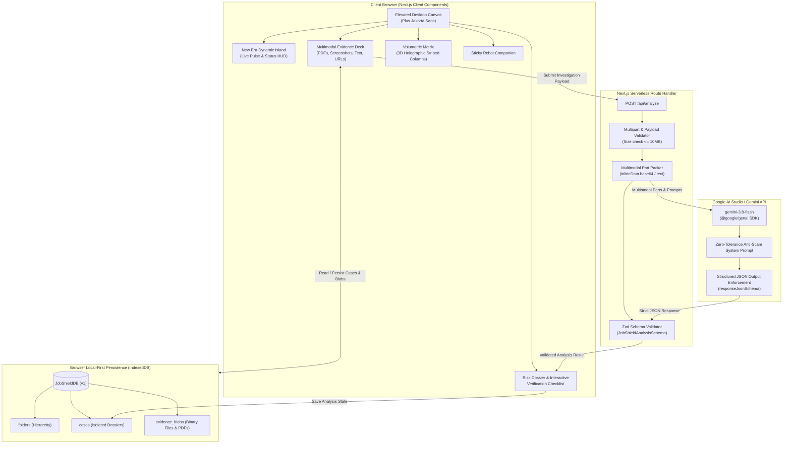

# JobShield 🛡️
> **"Verify before you trust."**  
> Next-generation recruitment evidence intake and AI-powered fraud investigation platform powered by **Google Gemini 3.8 Flash** multimodal intelligence.

[](https://nextjs.org/)
[](https://ai.google.dev/)
[](https://www.typescriptlang.org/)
[](https://tailwindcss.com/)
[](LICENSE)

---

## 📸 Interface Preview


JobShield features an elevated glassmorphic aesthetic inspired by modern fintech command centers:
- **New Era Dynamic Island**: Pinned glassmorphic HUD capsule floating at top-center with live pulse indicators, real-time investigation telemetry, and expandable controls.
- **Volumetric 3D Metric Columns**: Holographic striped indicators providing instantaneous visual feedback across Documents, Pitch Credibility, Domain Legitimacy, and Overall Trust.
- **Zentra Segmented Workspace**: Elevated desktop canvas with rounded pill contours (`rounded-[44px]`), organized across *Overview*, *Evidence Deck*, *Risk Dossier*, and *Verification*.
- **Docked AI Prompt Capsule**: Natural language interaction bar with preset verification slash commands (`/offer-authenticity`, `/recruiter-identity`, `/wire-fraud-check`, `/salary-benchmark`).
- **Interactive Robot Companion**: Pinned assistant offering real-time guidance and instant intake focusing.

---

## 🎯 The Mission & The Problem

Employment scams have surged by over 400% in recent years. Predatory actors impersonate Fortune 500 recruiters, orchestrate fake multi-stage interviews, and distribute deceptive offer letters demanding:
* Upfront "mandatory onboarding equipment deposits" or "training certification fees".
* Immediate submission of government IDs (Aadhaar, SSN, PAN) and banking coordinates before formal hire.
* Phishing redirects through subtly mistyped corporate domains (typosquatting).

**JobShield solves this.** Rather than reducing complex fraud signals to an arbitrary, ungrounded "scam score," JobShield functions as an **evidence-backed investigation workstation**. It ingests actual offer letter PDFs, recruiter emails, WhatsApp/Telegram screenshots, and job URLs, passing them through Google Gemini's multimodal vision and reasoning models to isolate empirical, verifiable facts.

---

## 🏛️ System Architecture



---

## 🚀 Quick Start & Usage

### Prerequisites
- [Node.js](https://nodejs.org/) (v20.x or higher)
- [npm](https://www.npmjs.com/) (v10.x or higher)
- A **Google Gemini API Key** from [Google AI Studio](https://aistudio.google.com/apikey).

### 1. Install Dependencies
```bash
npm install
```

### 2. Configure Environment Variables
```bash
cp .env.example .env.local
```

Add your Gemini API Key in `.env.local`:
```env
GEMINI_API_KEY=your_actual_gemini_api_key_here
GEMINI_MODEL=gemini-3.8-flash
```

### 3. Run Development Server
```bash
npm run dev
```

Open [http://localhost:3000](http://localhost:3000) in your browser.

---

## 📄 License
This project is licensed under the [MIT License](LICENSE).
