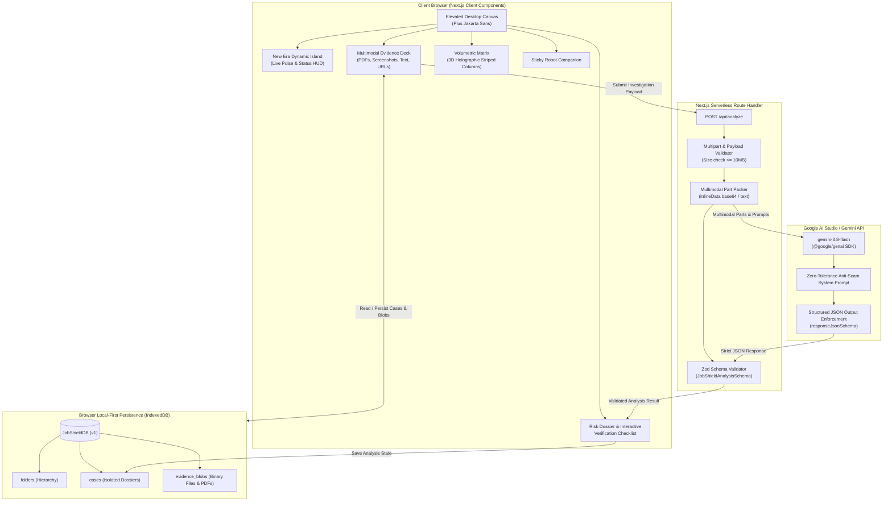

# JobShield 🛡️
> **"Verify before you trust."**  
> Next-generation recruitment evidence intake and AI-powered fraud investigation platform powered by **Google Gemini 3.8 Flash** multimodal intelligence.

[](https://nextjs.org/)
[](https://ai.google.dev/)
[](https://www.typescriptlang.org/)
[](https://tailwindcss.com/)
[](LICENSE)
[](https://vercel.com/new/clone?repository-url=https%3A%2F%2Fgithub.com%2FPranjalwork1%2FJobShield&root-directory=jobshield&env=GEMINI_API_KEY,GEMINI_MODEL&envDescription=Your%20Google%20Gemini%20API%20Key%20from%20Google%20AI%20Studio&envLink=https%3A%2F%2Faistudio.google.com%2Fapikey&project-name=jobshield)

---

## 📸 Interface Preview


JobShield features an elevated glassmorphic aesthetic inspired by modern fintech command centers:
- **New Era Dynamic Island**: Pinned glassmorphic HUD capsule floating at top-center with live pulse indicators, real-time investigation telemetry, and expandable controls.
- **Volumetric 3D Metric Columns**: Holographic striped indicators providing instantaneous visual feedback across Documents, Pitch Credibility, Domain Legitimacy, and Overall Trust.
- **Zentra Segmented Workspace**: Elevated desktop canvas with rounded pill contours (`rounded-[44px]`), organized across *Overview*, *Evidence Deck*, *Risk Dossier*, and *Verification*.
- **Docked AI Prompt Capsule**: Natural language interaction bar with preset verification slash commands (`/offer-authenticity`, `/recruiter-identity`, `/wire-fraud-check`, `/salary-benchmark`).
- **Interactive Robot Companion**: Pinned assistant offering real-time guidance and instant intake focusing.

---

## 🎯 The Mission & The Problem

Employment scams have surged by over 400% in recent years. Predatory actors impersonate Fortune 500 recruiters, orchestrate fake multi-stage interviews, and distribute deceptive offer letters demanding:
* Upfront "mandatory onboarding equipment deposits" or "training certification fees".
* Immediate submission of government IDs (Aadhaar, SSN, PAN) and banking coordinates before formal hire.
* Phishing redirects through subtly mistyped corporate domains (typosquatting).

**JobShield solves this.** Rather than reducing complex fraud signals to an arbitrary, ungrounded "scam score," JobShield functions as an **evidence-backed investigation workstation**. It ingests actual offer letter PDFs, recruiter emails, WhatsApp/Telegram screenshots, and job URLs, passing them through Google Gemini's multimodal vision and reasoning models to isolate empirical, verifiable facts.

---

## 🏛️ System Architecture



---

## 🧠 JobShield P3 — Intelligence Engine

JobShield P3 extends the platform beyond AI extraction into a **deterministic, evidence-backed intelligence layer**. While Gemini P2 interprets and extracts raw structured facts from multimodal documents, JobShield's deterministic intelligence engine ensures that all findings, contradictions, and action items are derived through auditable business rules with 100% determinism and traceability.

### The Three-Phase Pipeline

```
USER
 ↓
JOB CASE (P1: Evidence Intake & Local Isolation)
 ↓
GEMINI (P2: Multimodal Extraction & JSON Schema Enforcement)
 ↓
NORMALIZED FACTS (P3: Canonical Case Representation)
 ↓
DETERMINISTIC RULE ENGINE (P3: Evidence-Backed Rules)
 ↓
CONTRADICTION ENGINE (P3: Cross-Evidence Inconsistency Detection)
 ↓
EVIDENCE LINKING & AUDIT TRAIL (P3: Traceable Evidence References)
 ↓
VERIFICATION QUEUE (P3: Actionable Due Diligence Checklist)
 ↓
JOBSHIELD INTELLIGENCE REPORT & AUDIT TIMELINE
```

### Key P3 Pillars

1. **Conservative Fact Normalization (`lib/intelligence/normalize.ts`)**:
   - Standardizes company names (stripping legal suffixes like `Pvt Ltd`, `Private Limited`, `Inc`, `LLC` safely without altering brand words).
   - Normalizes salary representations into parsed amounts, currencies, and annual/monthly periods (e.g. `8.5 LPA` → `850,000 INR/annum`, `₹12,00,000` → `1,200,000 INR/annum`).
   - Parses recruiter email domains, detecting public free email providers (e.g. `gmail.com`, `yahoo.com`, `outlook.com`).
   - Normalizes international and national phone formats.

2. **Deterministic Rule Engine (`lib/intelligence/rules.ts`)**:
   - `PAYMENT_REQUEST`: Flags upfront fees, registration fees, laptop deposits, or training fees before formal hire (High Severity).
   - `FINANCIAL_CREDENTIALS`: Flags requests for bank account details, cancelled cheques, card numbers, UPI PINs, or OTPs (High Severity).
   - `SENSITIVE_DATA_REQUEST`: Flags government identity document requests (PAN, Aadhaar, Passport, SSN) before verified employment (Medium/High Severity).
   - `PUBLIC_RECRUITER_EMAIL`: Flags recruiters using free public domains for identifiable corporations (Medium Severity).
   - `DOMAIN_MISMATCH`: Flags discrepancies between recruiter email domains and stated corporate web domains (Medium Severity).
   - **Zero Scam Scores**: JobShield never displays misleading fraud probability percentages (e.g. "87% scam"). Findings are strictly evidence-backed.

3. **Cross-Evidence Contradiction Detection (`lib/intelligence/contradictions.ts`)**:
   - Compares facts across multiple evidence items (e.g., offer PDF vs. WhatsApp screenshot vs. recruiter email).
   - Detects salary discrepancies (e.g., Offer letter states ₹8.5 LPA while recruiter message promises ₹12 LPA).
   - Detects company identity conflicts (e.g., ABC Technologies vs. XYZ Solutions).
   - Detects recruiter and role conflicts across documents.
   - **Conservative Evaluation**: Missing data is never treated as a contradiction. Minor title variations are not falsely flagged.

4. **Evidence Linking & Audit Trail (`lib/intelligence/evidence.ts`)**:
   - Every intelligence finding and contradiction links directly to its source evidence item (PDF, image, text message, or URL).
   - Full 3-step visual trail: `Finding` → `Attributed Document` → `Observed Quote/Data`.

5. **Actionable Verification Queue (`lib/intelligence/verification.ts`)**:
   - Converts findings and extracted facts into a structured checklist:
     - Confirm employer identity via official corporate registries
     - Confirm job opening exists on company's verified careers portal
     - Verify recruiter identity with official HR switchboard
     - Confirm payment and document requirements directly with verified HR
   - All targets start in `not_started` status.

6. **Case Investigation Timeline (`lib/intelligence/types.ts`)**:
   - Immutable, per-case chronological audit log tracking case creation, evidence updates, Gemini analysis completions, and intelligence evaluations.

> **Important Boundary Notice**:  
> JobShield P3 analyzes **only the evidence supplied by the user**. It deliberately does **NOT** conduct web scraping, WHOIS domain lookups, LinkedIn searches, or live employer verification. Those capabilities are reserved for future phases. All UI messaging clearly reflects: *"Observed in supplied evidence • Requires independent verification"*.

---

## 🚀 Quick Start & Usage

### Prerequisites
- [Node.js](https://nodejs.org/) (v20.x or higher)
- [npm](https://www.npmjs.com/) (v10.x or higher)
- A **Google Gemini API Key** from [Google AI Studio](https://aistudio.google.com/apikey).

### 1. Install Dependencies
```bash
npm install
```

### 2. Configure Environment Variables
```bash
cp .env.example .env.local
```

Add your Gemini API Key in `.env.local`:
```env
GEMINI_API_KEY=your_actual_gemini_api_key_here
GEMINI_MODEL=gemini-3.8-flash
```

### 3. Run Development Server
```bash
npm run dev
```

Open [http://localhost:3000](http://localhost:3000) in your browser.

---

## 🌐 One-Click Cloud Deployment (Vercel)

[](https://vercel.com/new/clone?repository-url=https%3A%2F%2Fgithub.com%2FPranjalwork1%2FJobShield&root-directory=jobshield&env=GEMINI_API_KEY,GEMINI_MODEL&envDescription=Your%20Google%20Gemini%20API%20Key%20from%20Google%20AI%20Studio&envLink=https%3A%2F%2Faistudio.google.com%2Fapikey&project-name=jobshield)

### Deployment Steps:
1. Import repository **`Pranjalwork1/JobShield`** at [vercel.com/new](https://vercel.com/new).
2. Set **Root Directory** to `jobshield`.
3. Add environment variables:
   * `GEMINI_API_KEY`: *(Your key)*
   * `GEMINI_MODEL`: `gemini-3.8-flash`
4. Click **Deploy**.

---

## 📊 Operations Dashboard

The **JobShield Operations Dashboard** serves as the primary command center for recruitment fraud defense and investigation workflows. Inspired by high-trust security operations centers, it synthesizes empirical verification telemetry across all active dossiers.

```
                         JOBSHIELD OPERATIONS DASHBOARD
 ┌─────────────────────────────────────────────────────────────────────────────┐
 │ Sidebar          │ Dashboard / Workspace                                    │
 │                  │                                                           │
 │ JobShield AI     │ Overview                                                  │
 │                  │ ├── Dynamic Greeting & Workspace Health Telemetry         │
 │ Overview         │ ├── 4 Metric KPI Cards (Checks, Analyzed, Findings, Open) │
 │ Evidence Deck    │ ├── Live Recent Job Checks (Interactive Table/Cards)      │
 │ Risk Dossier     │ ├── Verification Health Ring  +  Risk Mix Donut Chart     │
 │ Verification     │ ├── Folder Allocation         +  Prioritized Next Actions │
 │                  │ └── Recent Audit Activity     +  Operational Status       │
 │ FOLDERS          │                                                           │
 │ ├── All Jobs     │                                                           │
 │ └── User Folders │                                                           │
 └─────────────────────────────────────────────────────────────────────────────┘
```

### Dashboard Core Components:
1. **Overview Header & Dynamic Greeting**:
   - Dynamic day indicator (e.g., `MONDAY OVERVIEW`) and contextual greeting based on local time.
   - Empirical situation assessment computed in real-time from active case states (e.g., *"3 checks need attention before hiring review"* or *"Your workspace is clear — no open verification items"*).
   - Current date range pill and active folder badge.
2. **Deterministic KPI Cards**:
   - **Active Checks**: Real count of active cases stored in browser IndexedDB.
   - **Analyzed Cases**: Total cases with completed multimodal analysis.
   - **Risk Findings**: Aggregated count of deterministic P3 findings across active investigations.
   - **Open Verification Targets**: Actionable corroboration tasks remaining open.
3. **Recent Job Checks**:
   - Displays live status across the active verification queue with role, company, finding summary, workflow status (`Draft`, `Analyzing`, `Analyzed`, `Needs Verification`), and relative timestamps.
   - Clicking any row navigates directly to the exact case workspace with complete evidence and analysis isolation.
4. **Risk Mix (Interactive Donut Chart)**:
   - Rendered using **Recharts** with accessible tooltips, custom center total badge, and dynamic semantic coloring (High: Red, Medium: Amber, Low: Blue).
   - **Empirical Grounding**: The Risk Mix chart strictly reflects **P3 evidence-backed finding severity** and is **NOT** a synthetic scam probability score or fraud verdict.
   - Clicking any segment filters the Risk Dossier directly to that severity class.
5. **Verification Health & Completion Rate**:
   - Visual progress ring displaying empirical resolution percentage: `(completed / total) * 100`.
   - Clear empty states when no verification targets have been generated yet.
6. **Folders Overview**:
   - Real-time case distribution and risk finding breakdown per user folder.
   - Direct navigation to folder-filtered views.
7. **Prioritized Next Actions**:
   - Dynamically compiled from unresolved contradictions and open verification targets across active dossiers.
   - Prioritized by severity (`High` > `Medium` > `Low`) with one-click direct jump buttons.
8. **Recent Activity & Tamper-Evident Audit Trail**:
   - Chronological event timeline recording case creation, evidence uploads, analysis runs, intelligence generation, and verification milestones.
9. **Operational System Status**:
   - Trust control monitoring displaying the live operational status of IndexedDB storage, case persistence, audit logging, and server-side Gemini configuration.

> **Privacy & Performance Guarantee**: All dashboard metrics are calculated strictly client-side from local IndexedDB case metadata. Binary evidence blobs are never hydrated to calculate dashboard metrics, ensuring instantaneous render speeds without network overhead.

---

## 📄 License
This project is licensed under the [MIT License](LICENSE).

